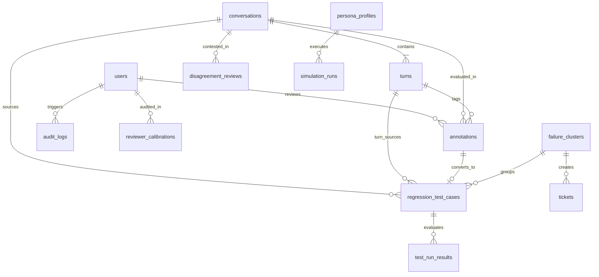

# AgentAssure Developer & Engineering Guide

## 1. Local Environment Setup

### Prerequisites
- Python 3.11+
- Node.js 20+ & npm 10+
- Docker & Docker Compose (optional for full containerized stack)

### Quick Local Setup
```bash
# 1. Clone and enter directory
cd AgentAssure

# 2. Set up Python virtual environment
python -m venv venv
source venv/bin/activate  # On Windows: .\venv\Scripts\activate

# 3. Install backend dependencies
pip install -r requirements.txt

# 4. Initialize Database & Seed Enterprise Mock Data
python -m agentassure.cli.main init-db

# 5. Setup & Build React Frontend
cd frontend
npm install
npm run build
cd ..

# 6. Launch Backend API Server (serves React UI on http://localhost:8000)
uvicorn agentassure.api.app:app --reload --port 8000
```

---

## 2. Database Schema ER Diagram



---

## 3. Running Automated Tests & Code Quality

AgentAssure maintains a strict **>85% coverage** requirement across 70+ test cases.

```bash
# Run full pytest suite with coverage report
python -m pytest --cov=agentassure --cov-report=term-missing

# Run with XML coverage artifact generation
python -m pytest --cov=agentassure --cov-report=xml

# Run specific functional test module
python -m pytest tests/test_release_gating.py -v

# Run Code Quality Linters
black --check agentassure tests
isort --check-only agentassure tests
flake8 agentassure tests --max-line-length=120
```

---

## 4. Load Testing with Locust

AgentAssure is load-tested for **50 concurrent QA reviewers** and **1,000 conversations/hour** ingestion:

```bash
# Run Locust in headless mode with 50 users and 5 spawn rate
locust -f locustfile.py --headless -u 50 -r 5 --run-time 1m --host http://localhost:8000
```

---

## 5. API Reference & Curl Examples

Interactive Swagger UI documentation is available at `http://localhost:8000/docs`.

### Authenticate and Obtain JWT
```bash
curl -X POST http://localhost:8000/api/v1/auth/login \
  -H "Content-Type: application/json" \
  -d '{"username": "admin", "password": "password123"}'
```

### Ingest Live Conversation with Real-Time PII Masking
```bash
curl -X POST http://localhost:8000/api/v1/sampling/ingest \
  -H "Content-Type: application/json" \
  -H "Authorization: Bearer <TOKEN>" \
  -d '{
    "customer_id": "+91 9876543210",
    "channel": "voice",
    "agent_version": "v2.5.0-rc1",
    "duration_seconds": 18.5,
    "language": "en",
    "judge_score": 0.45,
    "asr_error_rate": 0.12,
    "loop_count": 2,
    "customer_dropped": true,
    "negative_sentiment": 0.75,
    "sample_stratum": "risk_ranked",
    "turns": [
      {
        "turn_index": 0,
        "speaker": "user",
        "transcript": "My PAN is ABCDE1234F and I was offered 7.5% loan rate.",
        "audio_start_time": 0.0,
        "audio_end_time": 4.5
      }
    ]
  }'
```

### Trigger CI Release Gate Evaluation
```bash
curl -X POST http://localhost:8000/api/v1/release-gate/evaluate \
  -H "Content-Type: application/json" \
  -H "Authorization: Bearer <TOKEN>" \
  -d '{
    "agent_version": "v2.5.0-candidate",
    "baseline_version": "v2.4.0",
    "commit_hash": "c0ffee1"
  }'
```
