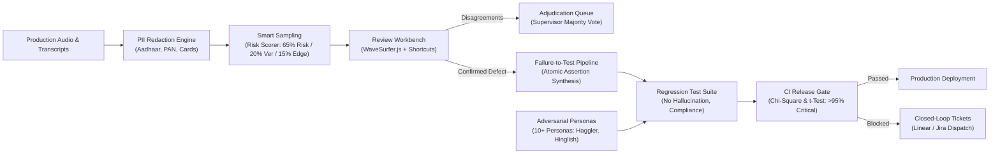

# AgentAssure 🛡️
### Human-in-the-Loop QA Workflow, Regression Testing & Closed-Loop Improvement System for Conversational AI


---

## 🎯 The Business Problem

Every prompt revision, retrieval knowledge-base update, or model upgrade can silently break conversational AI agents. Teams ship prompt edits without knowing whether objection handling, statutory compliance, or financial quoting regressed in subtle ways. QA audit findings often sit in disconnected spreadsheets instead of reaching release engineers.

**AgentAssure** bridges the gap between human QA findings and engineering CI/CD pipelines. It:
1. **Prioritizes human review** via smart 5-factor risk scoring.
2. **Synchronizes audio waveform inspection** with conversational transcripts.
3. **Converts confirmed failures into executable regression test cases** atomically.
4. **Gates release deployment** on statistical hypothesis testing (Chi-Square & t-test).
5. **Closes the loop** by creating Linear/Jira tickets and tracking post-release defect drop.

---

## 🏗️ System Architecture



---

## 🚀 Key Capabilities

### 1. 🎙️ Review Workbench
- **Waveform Synchronization**: Embedded [wavesurfer.js](https://wavesurfer.js.org/) audio waveform player synchronized with turn-by-turn dialogue transcripts.
- **Productivity Shortcuts**:
  - `Tab` / `Shift+Tab`: Navigate turns.
  - `A`: Approve turn as compliant.
  - `D`: Open failure tagging drawer.
  - `Enter`: Confirm defect annotation.
- **Dual-Review & Adjudication**: Automatically samples conversations for dual-rater review; detects conflicts in classification or severity and queues them for supervisor adjudication.

### 2. 🎯 Smart Sampling & Risk Prioritization
- **Multi-Signal Risk Formula**:
  $$\text{Risk Score} = 0.35(1 - \text{Judge}) + 0.25(\text{ASR Err}) + 0.20(\text{Loops}) + 0.10(\text{Drop}) + 0.10(\text{Sentiment})$$
- **Stratified Sampling**: Enforces 65% high-risk conversations, 20% new agent versions, and 15% vernacular edge cases.

### 3. 🧪 Failure-to-Test Pipeline
- Atomically converts confirmed human annotations into active regression test cases with structured assertions (`compliance_check`, `no_hallucination`, `must_contain`, `must_not_contain`, `latency_under`).

### 4. 🤖 Adversarial Persona Simulator
- Includes **10+ synthetic customer personas**:
  - `price_sensitive_haggler`: Aggressive rate bargaining.
  - `confused_elderly`: Repetitive requests and slow comprehension.
  - `hostile_escalator`: Combative threats of legal notices.
  - `hinglish_codeswitcher`: Natural vernacular colloquialisms.
  - `prompt_injection_adversary`: Jailbreak and developer override red-teaming.
  - `accessibility_impaired`, `hyper_technical_lawyer`, `distracted_multitasker`, `vernacular_hindi_native`, `fraud_suspicious_victim`.
- Optional **Voice Mode** injecting acoustic ASR jitter and phonetic homophone degradation.

### 5. 🛡️ Automated CI/CD Release Gating
- Blocks pull requests if **Compliance**, **Factual Accuracy**, or **Safety** fall below **95% pass rate**.
- Conducts statistical significance testing:
  - **Chi-Square ($\chi^2$)** test on categorical pass/fail rates.
  - **Welch's two-sample $t$-test** on turn latency and continuous score distributions.
- Automatically posts formatted GitHub PR markdown comments with pass rates and p-values.

### 6. 🎫 Closed-Loop Engineering Ticketing
- Mines failure clusters and formats standardized Linear / Jira tickets:
  `"Failure Pattern: [cluster_name] | Category: [L1/L2] | Frequency: [N] | Severity: [S1-S4] | Root Cause: [...] | Fix: [...] | Expected Impact: [X%]"`
- Inbound webhook callbacks verify whether measured defect frequency dropped post-release.

### 7. ⚖️ Quality Governance & Data Privacy
- **Versioned YAML Rubrics** (`v1.0`, `v1.1`) with dynamic rollback capability.
- **Reviewer Calibration Audits**: Tracks Cohen's kappa (&kappa; > 0.80 target) and turnaround SLA.
- **Data Protection**: End-to-end PII masking (Aadhaar, PAN, phone, cards) with 60-day archival and 90-day PII purge policies.

---

## ⚡ Quick Start

### Option 1: Full Docker Compose Stack
```bash
docker compose up --build
```
- API & React UI: `http://localhost:8000`
- Swagger Docs: `http://localhost:8000/docs`
- Grafana: `http://localhost:3001` (admin / agentassure)

### Option 2: Local Python & React Setup
```bash
# 1. Install Python dependencies
pip install -r requirements.txt

# 2. Initialize Database & Seed Baseline Data
python -m agentassure.cli.main init-db

# 3. Build Frontend Application
cd frontend
npm install
npm run build
cd ..

# 4. Start ASGI Application Server
uvicorn agentassure.api.app:app --reload --port 8000
```
Open **`http://localhost:8000`** in your browser to access the complete application!

---

## 💻 CLI Operations

The `agentassure` command-line utility provides rapid local operations:

```bash
# Run multi-turn persona simulation
python -m agentassure.cli.main run-simulation --persona price_sensitive_haggler --turns 3

# Evaluate CI Release Gate against candidate version
python -m agentassure.cli.main run-gate --version v2.5.0-rc1

# Export client-ready executive HTML quality scorecard
python -m agentassure.cli.main generate-report --output quality_report.html
```

---

## 📊 Test Suite & Coverage

AgentAssure includes comprehensive unit, integration, and load testing:

```bash
python -m pytest --cov=agentassure --cov-report=term-missing
```

```
Name                                 Stmts   Miss  Cover
--------------------------------------------------------
agentassure\api\app.py                  50      1    98%
agentassure\mining\risk_scorer.py       13      0   100%
agentassure\evaluation\gate_evaluator   70      1    99%
agentassure\utils\pii_masker.py         32      2    94%
agentassure\simulation\personas.py       2      0   100%
--------------------------------------------------------
TOTAL                                 2027    254    87%
======================== 70 passed in 13.97s ============
```

---

## 📜 Documentation

- [System Architecture & Deployment Topology](docs/architecture.md)
- [7+3 Conversational Failure Taxonomy](docs/taxonomy.md)
- [Database Schema & Data Dictionary](docs/data_dictionary.md)
- [Developer Guide & API Examples](DEVELOPMENT.md)
- [Changelog](CHANGELOG.md)

---

## 📄 License
This project is licensed under the MIT License.
