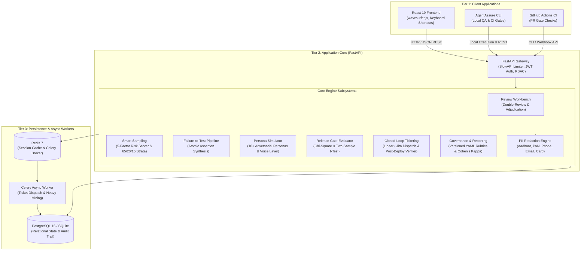
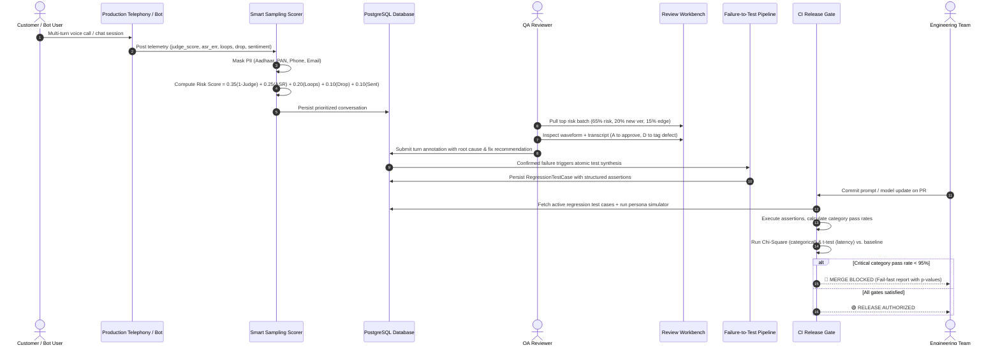

# AgentAssure System Architecture

## 1. High-Level Architecture Overview

AgentAssure is a three-tier, cloud-native Human-in-the-Loop QA, regression testing, and closed-loop improvement platform for enterprise conversational AI agents. It bridges the critical divide between customer support QA findings and production release engineering.

---

## 2. End-to-End Data Flow

---

## 3. Deployment Topology

AgentAssure is containerized via a multi-stage Docker build producing a lean runtime (<300MB). In production, it deploys via Kubernetes or Docker Compose:

1. **`agentassure-api`**: FastAPI ASGI container running Uvicorn workers behind an ingress load balancer.
2. **`agentassure-postgres`**: PostgreSQL 16 cluster with connection pooling (`pool_size=10`, `max_overflow=20`) and read-replica support.
3. **`agentassure-redis`**: In-memory broker for Celery async tasks and rate-limiting counters.
4. **`agentassure-worker`**: Celery worker instance offloading batch cluster mining and ticket creation.
5. **`agentassure-grafana`**: Operational observability dashboard monitoring queue latency, reviewer turnaround SLA, and test pass rate trends.

---

## 4. Failure Scenarios and Resiliency

| Failure Scenario | Mitigation Strategy | Recovery Time Objective (RTO) |
| :--- | :--- | :--- |
| **Database Network Partition** | Connection pool with pre-ping validation (`pool_pre_ping=True`) and exponential backoff retry. | < 5 seconds |
| **Redis Broker Failure** | Automatic fallback to in-memory eager task execution (`CELERY_TASK_ALWAYS_EAGER=True`). | Instantaneous (0s) |
| **API Rate Spikes / Abuse** | SlowAPI IP-based rate limiting (100 req/min default) returning HTTP 429. | Instantaneous (0s) |
| **Dual Reviewer Disagreement** | Automated conflict detection routing to supervisor adjudication queue with majority resolution. | Handled in SLA |
| **Regulatory PII Exposure** | Deterministic pre-storage regex redaction for Aadhaar, PAN, phone numbers, and payment cards. | Zero-leakage guarantee |
